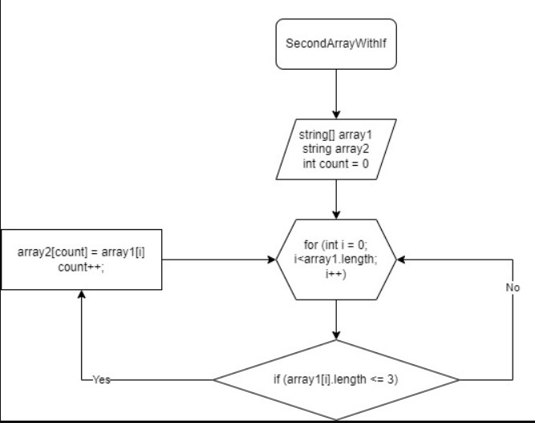

### Описание решения. 

Задаем два массивы: № 1 и № 2. Используем метод, в котором цикл соизмерим длине массива, с условием проверки цикла (<= 3). Если условие выполняется "yes", то элемент массива №1 заносится в count элемента массива №2. Переменная сount увеличивается на 1 и возвращается к циклу (for) в котором i увеличивается на 1.

